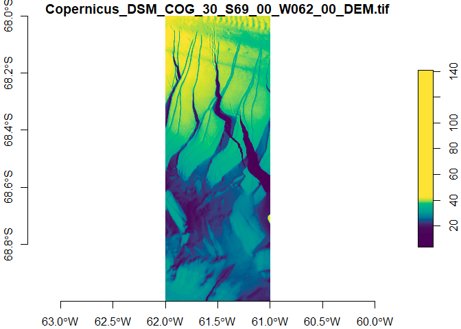

# CopernicusDataspace 

<!-- badges: start -->

[](https://github.com/pepijn-devries/CopernicusDataspace/actions/workflows/R-CMD-check.yaml)
[](https://CRAN.R-project.org/package=CopernicusDataspace)
[](https://lifecycle.r-lib.org/articles/stages.html#experimental)
[](https://app.codecov.io/gh/pepijn-devries/CopernicusDataspace)
<!-- badges: end -->

The [Copernicus Data Space Ecosystem](https://dataspace.copernicus.eu/),
is an open ecosystem that provides free instant access to a wide range
of data and services from the Copernicus Sentinel missions and more on
our planet’s land, oceans and atmosphere. This package provides entry
points to several APIs allowing users to access the data directly in R.

## Installation

At the moment, the package is still only experimental. It can therefore
only be installed from GitHub:

``` r
devtools::install_github("CopernicusDataspace", username = "pepijn-devries")
```

<!-- TODO update installation procedure once available -->

<!--
Install CRAN release:
&#10;
``` r
install.packages("CopernicusDataspace")
```
&#10;Install latest developmental version from R-Universe:
&#10;
``` r
install.packages("CopernicusDataspace", repos = c('https://pepijn-devries.r-universe.dev', 'https://cloud.r-project.org'))
```
-->

## Introduction

The Copernicus Data Space Ecosystem offers access to its services
through several
[APIs](https://documentation.dataspace.copernicus.eu/APIs.html). This
package offers access via the following APIs:

- [OData](https://documentation.dataspace.copernicus.eu/APIs/OData.html);
- [STAC](https://documentation.dataspace.copernicus.eu/APIs/STAC.html);
  and
- [SentinelHub](https://documentation.dataspace.copernicus.eu/APIs/SentinelHub.html).

This README shows only essential methods for downloading data. For more
detailed information consult the respective vignettes:

- `vignette("OData")`;
- `vignette("STAC")`; and
- `vignette("SentinelHub")`

## Authentication

When actually downloading files from the Copernicus Data Space
Ecosystem, you usually need some form of authentication. Examples below
use credentials stored as environment variables. For more information
about how to effectively authenticate download requests, please see
`vignette("Authentication")`.

## Downloading Using STAC Catalogue

When you know the STAC identifier (`id`) and the asset name you wish to
download, you can simply use the example shown below. When you don’t
know these details, you should first explore the catalogue. Please see
`vignette("STAC")` for more details on working with the STAC catalogue.

``` r
library(CopernicusDataspace)
library(stars) ## For reading and plotting the downloaded file

## Only run this if an S3 secret is specified
if (dse_has_s3_secret()) {
  
  id       <- "Copernicus_DSM_COG_30_S69_00_W062_00_DEM"
  asset    <- "data"

  filename <- dse_stac_download(id, asset, tempdir())
  tile     <- read_stars(filename)
  plot(tile, col = hcl.colors(100), axes = TRUE)
  
}
```



## Downloading Using OData API

TODO

## Downloading Using SentinelHub

TODO

## More of Copernicus

More R packages for exploring other Copernicus data services:

- [CopernicusClimate](https://github.com/pepijn-devries/CopernicusClimate)
  Dedicated to climate change datasets
- [CopernicusMarine](https://github.com/pepijn-devries/CopernicusMarine)
  Dedicated to marine datasets

## Code of Conduct

Please note that the CopernicusDataspace project is released with a
[Contributor Code of
Conduct](https://contributor-covenant.org/version/2/1/CODE_OF_CONDUCT.html).
By contributing to this project, you agree to abide by its terms.
