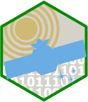

# CopernicusDataspace 

<!-- badges: start -->

[](https://github.com/pepijn-devries/CopernicusDataspace/actions/workflows/R-CMD-check.yaml)
[](https://CRAN.R-project.org/package=CopernicusDataspace)
[](https://lifecycle.r-lib.org/articles/stages.html#experimental)
<!-- badges: end -->

The [Copernicus Data Space Ecosystem](https://dataspace.copernicus.eu/),
is an open ecosystem that provides free instant access to a wide range
of data and services from the Copernicus Sentinel missions and more on
our planet’s land, oceans and atmosphere. This package provides entry
points to several APIs allowing users to access the data directly in R.

## Installation

Install latest developmental version from R-Universe:

``` r
install.packages("CopernicusDataspace", repos = c('https://pepijn-devries.r-universe.dev', 'https://cloud.r-project.org'))
```

## Example

TODO

``` r
library(CopernicusDataspace)
## TODO
```

## Code of Conduct

Please note that the CopernicusDataspace project is released with a
[Contributor Code of
Conduct](https://contributor-covenant.org/version/2/1/CODE_OF_CONDUCT.html).
By contributing to this project, you agree to abide by its terms.
