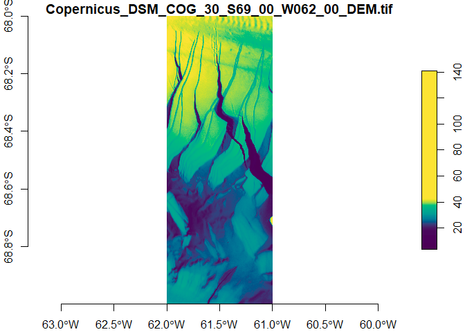
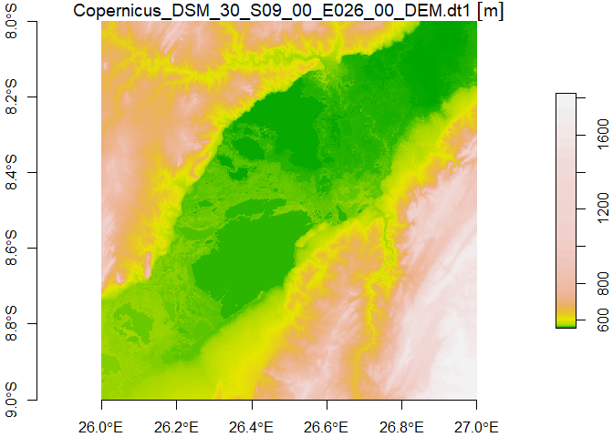
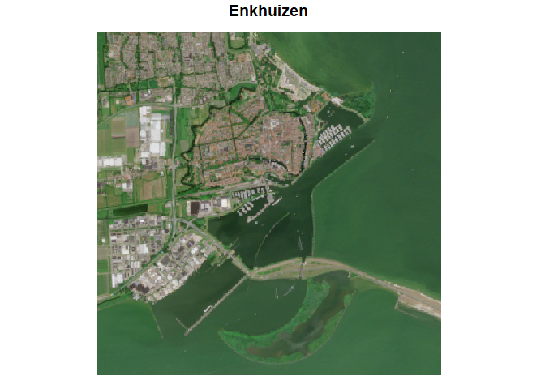

# CopernicusDataspace 

<!-- badges: start -->

[](https://github.com/pepijn-devries/CopernicusDataspace/actions/workflows/R-CMD-check.yaml)

[](https://CRAN.R-project.org/package=CopernicusDataspace)
[](https://cran.r-project.org/web/checks/check_results_CopernicusDataspace.html)
[](https://pepijn-devries.r-universe.dev/CopernicusDataspace)
[](https://app.codecov.io/gh/pepijn-devries/CopernicusDataspace)
<!-- badges: end -->

The [Copernicus Data Space Ecosystem](https://dataspace.copernicus.eu/),
is an open ecosystem that provides free instant access to a wide range
of data and services from the Copernicus Sentinel missions and more on
our planet’s land, oceans and atmosphere. This package provides entry
points to several APIs allowing users to access the data directly in R.

## Installation

Install CRAN release:

``` r
install.packages("CopernicusDataspace")
```

Install latest developmental version from R-Universe:

``` r
install.packages("CopernicusDataspace", repos = c('https://pepijn-devries.r-universe.dev', 'https://cloud.r-project.org'))
```

## Introduction

The Copernicus Data Space Ecosystem offers access to its services
through several
[APIs](https://documentation.dataspace.copernicus.eu/APIs.html). This
package offers access via the following APIs. This README shows only
essential methods for downloading data. For more detailed information
consult the respective vignettes:

- [OData](https://documentation.dataspace.copernicus.eu/APIs/OData.html);
  details in `vignette("OData")`,
- [STAC](https://documentation.dataspace.copernicus.eu/APIs/STAC.html);
  details in `vignette("STAC")`, and
- [SentinelHub](https://documentation.dataspace.copernicus.eu/APIs/SentinelHub.html);
  details in `vignette("SentinelHub")`.

## Authentication

When actually downloading files from the Copernicus Data Space
Ecosystem, you usually need some form of authentication. Examples below
use credentials stored as environment variables. For more information
about how to effectively authenticate download requests, please see
`vignette("Authentication")`.

## Downloading Using STAC Catalogue

When you know the STAC identifier (`asset_id`) and the asset name you
wish to download, you can simply use the example shown below. It will
often speed you request up if you include the `collection` id. When you
don’t know these details, you should first explore the catalogue. Please
see `vignette("STAC")` for more details on working with the STAC
catalogue.

``` r
library(CopernicusDataspace)
library(stars) ## For reading and plotting the downloaded file

## Only run this if an S3 secret is specified:
if (dse_has_s3_secret()) {
  
  filename  <- dse_stac_download(
    asset_id   = "Copernicus_DSM_COG_30_S69_00_W062_00_DEM",
    asset      = "data",
    collection = "cop-dem-glo-90-dged-cog",
    tempdir())
  
  tile_stac <- read_stars(filename)
  
  plot(tile_stac, col = hcl.colors(100), axes = TRUE)
  
}
```



This produces a tile in the Southern Ocean near Antarctica.

## Downloading Using OData API

The example below briefly demonstrate how to download data using with
the OData API wrapped by this package. This produces a map of Lake
Upemba in Congo. For more extensive information about the API and
workflow check out `vignette("OData")`.

``` r

## Only run this if client info is available:
if (dse_has_account()) {
  response <-
    dse_odata_download_path(
    product     = "2f497806-0101-5eea-83fa-c8f68bc56b0c",
    node_path   = paste(
      "DEM1_SAR_DTE_90_20101213T034716_20130408T035028_ADS_000000_5033.DEM",
      "Copernicus_DSM_30_S09_00_E026_00", "DEM",
      "Copernicus_DSM_30_S09_00_E026_00_DEM.dt1", sep = "/"),
    destination = tempdir())
  
  tile_odata <- read_stars(response$body)
  plot(tile_odata, col = terrain.colors(100), axes = TRUE)
}
```



## Downloading Using SentinelHub

SentinelHub is a service that remotely processes raw Sentinel data and
returns the result. Below a quick demonstration of the process. For more
detailed information check `vignette("SentinelHub")`

``` r
## Only run this if client info is available:
if (dse_has_client_info()) {
  bounds <- c(5.261, 52.680, 5.319, 52.715)

  ## prepare input data:
  input <-
    dse_sh_prepare_input(
      bounds = bounds,
      time_range = c("2025-06-01 UTC", "2025-07-01 UTC")
    )

  ## prepare ouput format:
  output <- dse_sh_prepare_output(bbox = bounds)

  ## retrieve processing script:
  evalscript <- dse_sh_get_custom_script("/sentinel-2/l2a_optimized/")

  ## destination file:
  fl <- tempfile(fileext = ".tiff")
  
  ## send request and download result:
  dse_sh_process(input, output, evalscript, fl)

  ## read and plot result:
  enkhuizen <- read_stars(fl) |> suppressWarnings()
  plot(enkhuizen, rgb = 1:3, main = "Enkhuizen")
}
```



## Function Names

Understanding the naming logic of the functions in this package, will
help you navigating through all features, and effectively use them.

Most function names in this package start with the acronym `dse` (Data
Space Ecosystem). This is done to avoid confusion with other Copernicus
packages (see below) and unintended masking of other functions.

Exceptions are functions that (intentionally) mask functions from other
packages (like `req_perform()`), and functions that implement generic
functions from tidyverse packages (see `?tidy_verbs`).

Functions are also grouped to highlight the specific API they support.
After the `dse` acronym, these function names contain a reference to the
relevant API (`odata`, `stac` and `sh` (SentinelHub)). If a function
name starts with `dse` but is not followed by a reference to a specific
API, it will have a more generic purpose (like for instance
authorisation).

## OpenEO

OpenEO is and will not be supported by the package at hand. It has a
dedicated R package on CRAN:
[openeo](https://doi.org/10.32614/CRAN.package.openeo), with additional
documentation available at
[copernicus.eu](https://documentation.dataspace.copernicus.eu/APIs/openEO/R_Client/R.html).
[OpenEO](https://openeo.org/about.html) allows to process data remotely
and retrieve only processed data.

## More of Copernicus

More R packages for exploring other Copernicus data services:

- [CopernicusClimate](https://github.com/pepijn-devries/CopernicusClimate)
  Dedicated to climate change datasets
- [CopernicusMarine](https://github.com/pepijn-devries/CopernicusMarine)
  Dedicated to marine datasets

## Code of Conduct

Please note that the CopernicusDataspace project is released with a
[Contributor Code of
Conduct](https://contributor-covenant.org/version/2/1/CODE_OF_CONDUCT.html).
By contributing to this project, you agree to abide by its terms.

## Acknowledgement

This software has been developed as part of the statutory task programme
“fisheries research” and is subsidised by the [Dutch Ministry of
Agriculture, Nature and Food Quality.](https://ror.org/03b1hdw57).
