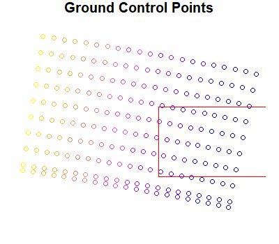
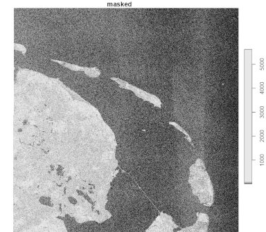
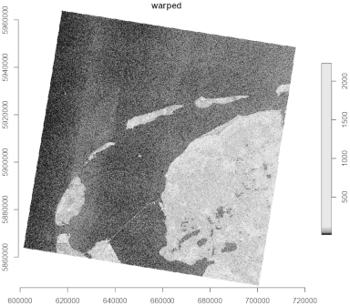

# Reading Data

``` r

library(CopernicusDataspace)
library(dplyr)
library(jsonlite)
library(sf)
library(stars)
```

The Copernicus Data Space Ecosystem (CDSE) provides a wide range of data
formats, each with their own quirks. Therefore, this package focuses
only on wrapping the CDSE Application Programming Interface (API).
Allowing to search and download the files. Because of the diversity of
data and data formats, there is no consistent way of supporting this for
CDSE from this package.

Instead, some frequently found formats are presented here, and a user
case is demonstrated. With the purpose of making this package more
applicable in practical settings.

## Ground Control Points

In some cases data is stored as raster data, in the orientation in which
the satellite made the observation. Such data may not have a valid
Coordinate Reference System (CRS), but instead have Ground Control
Points (GCP), to geo-reference the data. For any spatial analyses, you
first need to warp that data to a meaningful projection. But any data
masks are preferably applied to the raw data before such warps (which
require interpolation).

Let’s demonstrate this step-by-step with a user-case. We have a product
Id, in a specific collection, and we have a bounding box: the area of
interest. We first obtain the Uniform Resource Identifier (URI) for the
S3 service of this product
([`dse_stac_get_uri()`](https://pepijn-devries.github.io/CopernicusDataspace/reference/dse_stac_get_uri.md)).
We then convert this URI to a Virtual System Interface (VSI) using
[`dse_s3_uri_to_vsi()`](https://pepijn-devries.github.io/CopernicusDataspace/reference/dse_s3_uri_to_vsi.md).
We do this because we can directly connect with a product using the VSI
in
[`stars::read_stars()`](https://r-spatial.github.io/stars/reference/read_stars.html).
Note that we do need to run
[`dse_s3_set_gdal_options()`](https://pepijn-devries.github.io/CopernicusDataspace/reference/dse_s3_set_gdal_options.md)
first, this will make the S3 secrets available to the GDAL driver used
by the `stars` package.

This will create a proxy raster object. Meaning that no data is
transferred unless necessary. This allows us to lazily specify
operations for the raster object, before it is even downloaded. All
these steps are shown below.

``` r

if (dse_has_s3_secret()) {
  ## Define the area of interest:
  bbox <- st_bbox(c(xmin =  4.66,
                    ymin = 52.842,
                    xmax =  7.15,
                    ymax = 53.62), crs = 4326)
  
  ## Assume that we have already located the asset below within our
  ## area of interest:
  id <- "S1A_IW_GRDH_1SDV_20241125T055820_20241125T055845_056707_06F55C_12F9_COG"
  
  ## And it's from this collection:
  cllctn <- "sentinel-1-grd"
  
  ## Get the URI for the manifest.safe file. This is the preferred entry
  ## point into the data. It contains all bands and all meta-information
  ## (like accurate Ground Control Points):
  uri_safe <- dse_stac_get_uri(id, "safe_manifest", cllctn)
  
  ## Translate the URI into a virtual system indicator (VSI), such that
  ## the stars package can interact with it:
  vsi_safe <- dse_s3_uri_to_vsi(uri_safe)
  
  ## Set up the S3 credentials such that the stars package (and its
  ## underpinning GDAL library) will recognise them.
  dse_s3_set_gdal_options()
  
  ## Create a stars proxy object from the VSI. No data is downloaded
  ## yet. But you can set up lazy data manipulations with tidyverse.
  proxy <- read_stars(vsi_safe, proxy = TRUE)
}
```

As we are working with the `stars` package in this demonstration, we
have to acknowledge that this package does not preserve the GCPs when
manipulating the raster. Therefore, we explicitly read the information
from the original product, such that we can later rely on it.

As the raw data is not geo-referenced, we can also use the GCP
information to subset the raw data to the area of interest. This in
order to reduce data transfer and computational effort.

``` r

## Use `gdal_info` to retrieve the raster information
json_info <-
  gdal_utils("info", vsi_safe, options = c("-json"), quiet = TRUE) |>
  fromJSON()

## Get the ground control points for the specific raster.
## You will need it for subsetting the proxy.
gcp <-
  st_as_sf(json_info$gcps$gcpList, coords= c("x", "y"), crs = 
             st_crs(json_info$gcps$coordinateSystem$wkt))

## A plot showing where the raster's GCPs are, and where the bbox lies
par(mar = c(1, 1, 1, 1))
plot(gcp["pixel"] |> st_geometry(), main = "Ground Control Points", col = NA)
plot(gcp["pixel"], add = TRUE)
plot(bbox |> st_as_sfc() |> st_geometry(), border = "red", add = TRUE)

## Determine which raster indices are within the bbox
## of our area of interest:
gcp_crop <-
  st_crop(gcp,
          st_transform(bbox |>
                         st_as_sfc() |>
                         st_buffer(units::as_units(1, "km")),
                       st_crs(json_info$gcps$coordinateSystem$wkt)))

dim_x <- st_get_dimension_values(proxy, "x") |> sort()
dim_x <- which(dim_x >= min(gcp_crop$pixel) & dim_x <= max(gcp_crop$pixel))
dim_y <- st_get_dimension_values(proxy, "y") |> sort()
dim_y <- which(dim_y >= min(gcp_crop$line) & dim_y <= max(gcp_crop$line))
```



The product contains two bands (VH and VV). Both bands share the same
geometry and use the same GCPs. Therefore, we can use the VV band to
mask the VH band, and only use VH values when VV measurements are at
least 30 dB. Calling
[`stars::write_stars()`](https://r-spatial.github.io/stars/reference/write_stars.html)
will force the lazy operations to be executed and only the require data
is downloaded and stored at the specified location.

``` r

masked_proxy <-
  proxy[,dim_x, dim_y,] |>
  st_apply(c("x", "y"), \(x) {
    ## From json_info$bands we know that band 1=VH and 2=VV
    ## We want VH but only when VV >= 30:
    ifelse(x[2] >= 30, x[1], NA)
  })

## Store the masked file:
masked_file <- tempfile(fileext = ".tif")
write_stars(masked_proxy, masked_file, chunk_size = c(1024, 1024),
            NA_value = -9999)
```

The VH band is now masked. But when it is plotted, you will notice (if
you are familiar with the area) that the image is mirrored. That is
because it is shown in the raster index coordinates.

``` r

masked <- read_stars(masked_file)
plot(masked, main = "masked")
```



In the process of masking, sub-setting and downloading the data, the
GCPs got lost. So we first need to reintroduce them, before we can
continue.

``` r

## The masked file has lost original GCP information
## So create a reference file where we explicitly add the GCP info
ref_file <- tempfile(fileext = ".tif")

## Update GCP info for selected raster indices:
gcp <-
  json_info$gcps$gcpList |>
  mutate(pixel = pixel - min(dim_x) - 1,
         line = line - min(dim_y) - 1) |>
  filter(line >= 0 & pixel >= 0)
opts <-
  cbind("-gcp", as.matrix(gcp[, c("pixel", "line", "x", "y", "x")])) |>
  apply(1, c) |> c()

## Create reference file with GCP info
gdal_utils(
  "translate",
  source = masked_file,
  destination = ref_file,
  options = c(opts,
              "-a_srs", json_info$gcps$coordinateSystem$wkt,
              "-a_nodata", "-9999") ## missing values
)
```

Now that the GCPs have been reintroduced, we can warp the image to a
relevant CRS. In our case we create a 10m x 10m grid in UTM31N
projection.

``` r

## Warp the masked file to a fixed raster with meaningful CRS
## (In this case UTM31 with 10x10m cells)
warped_file <- tempfile(fileext = ".tif")

gdal_utils(
  "warp",
  source = ref_file,
  destination = warped_file,
  options = c(
    "-t_srs", "EPSG:32631",
    "-tps",
    "-tr", c(10, 10), "-tap", "-r", "bilinear",
    "-srcnodata", "-9999", ## missing values
    "-dstnodata", "-9999", ## missing values
    "-overwrite"))
warped <- read_stars(warped_file)

plot(warped, reset = FALSE, axes = TRUE, main = "warped")
```



## Alternative Raster Packages

As this package is only a wrapper around the API and files retrieved
with the package can be handled by any suitable package. Here we choose
to work with `stars` as it is relatively easy to use and go hand-in-hand
with tidyverse operators.

However, files could just as well be processed with the
[`terra`](https://rspatial.github.io/terra/) package, which is generally
faster than [`stars`](https://r-spatial.github.io/stars/). You could
also work with [`gdalraster`](https://firelab.github.io/gdalraster/)
which provides low level access to GDAL library features for raster
files.
